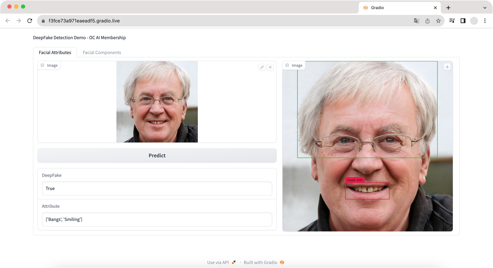
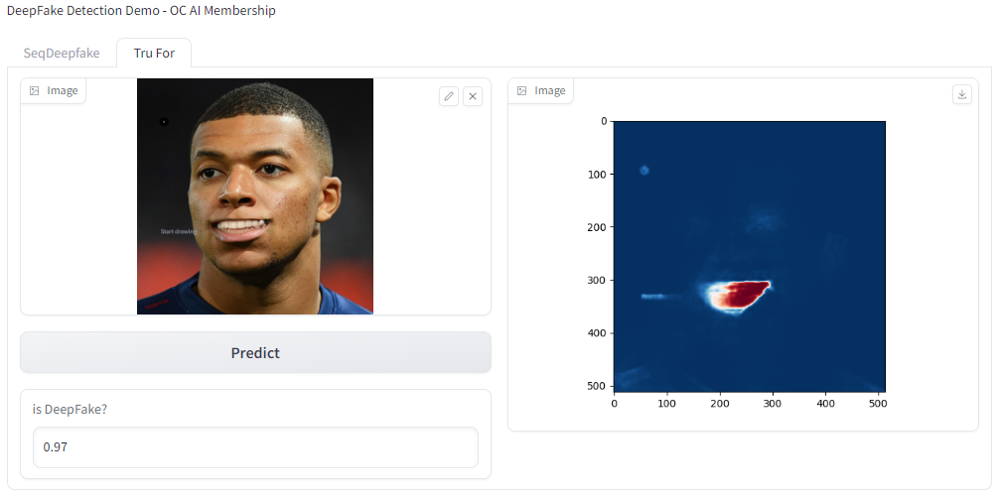

# Antitifake
Consolidated deepfake detection solution
<!--
[](https://ebpf.io/projects#loxilb) [](https://goreportcard.com/report/github.com/loxilb-io/loxilb)    [![Info][docs-shield]][docs-url] [](https://www.loxilb.io/members)  
-->

## What is Antitifake

Antitifake is an open source deepfake detection tool for consolidated methods.

### 📦 Antitifake aims to provide the following :   
#### Detect
- SeqDeepfake
    - Facial Attributes: bangs, eyeglasses, beard, smiling, young
    - Facial Components: nose, eye, eyebrow, lip, hair
    
    

- TruFor
    - Interprets deepfake detection numerically based on a scale from 0 to 1.

    

### Setting
⚠️You have to set **cuda compute capability** before install requirements.txt
1. ```export TORCH_CUDA_ARCH_LIST=8.6```
2. ```pip3 install -r requirements.txt```

### 🧿 Antitifake is composed of:       
#### Model
- [SeqDeepFake](https://github.com/rshaojimmy/SeqDeepFake) : detect deepfake and manipulated part(attributes, components)
- [GroundingDINO](https://github.com/IDEA-Research/GroundingDINO) : boxing the manipulated part on image
- [TruFor](https://github.com/grip-unina/TruFor) : Rely on the extraction of both high-level and low-level traces through a transformer-based fusion architecture that combines the RGB image and a learned noise-sensitive fingerprint.

#### Code
<code>python [app.py](app.py)</code>

### To-Do :       
- [x] Import SeqDeepFake to antitifake
  - ~~analyze gradio code~~
  - ~~integrate into app.py~~

- [x] Use grounding dino for visualize
  - ~~analyze grounding dino and import~~
- Import other baselines
    * [Candidates](https://github.com/Daisy-Zhang/Awesome-Deepfakes-Detection)
- Models to Be Tested
    * [DNA-Det](https://github.com/ICTMCG/DNA-Det) : a method for Deepfake Network Architecture Attribution to attribute fake images on architecture-level.


 
### 📚 Check Antitifake [Documentation](https:///) for more info.   

[docs-shield]: https://img.shields.io/badge/info-docs-blue
[docs-url]: https://loxilb-io.github.io/loxilbdocs/
[slack=shield]: https://img.shields.io/badge/Community-Join%20Slack-blue
[slack-url]: https://www.loxilb.io/members
